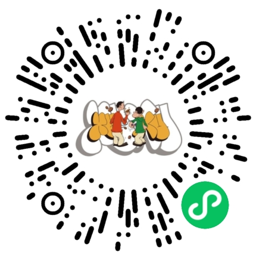

# DJOneHub

DJI 4G 模块的 Mac、iPhone/iPad 与 QDC507 Agent 源码，以及用于诊断和修复 QDC507 USB/QMI/ADB 状态的辅助工具。

## 鸣谢

- 感谢小红书博主 [「小吴折腾AI」](https://xhslink.cn/o/70Ecv4YqEvk) 的一同开发。
- 感谢 [XUXU](https://xhslink.cn/o/AYJ2PKK9tyj) 的大力支持。
- 感谢 [Jamie（@没错jamie就是我）](https://xhslink.cn/o/2CbGt9pN3AB)。
- 感谢 [JieDen](https://xhslink.cn/o/5WQkSOfgE3i)。

## 支持小店

这是我的微信小程序，售卖咖啡豆和茶叶；如果你喜欢这个项目，欢迎扫码支持，感谢大家。

当前仓库首发版本为 `v1.0.0`。这是 GitHub 项目版本；各组件保留其真实独立版本，避免发布包与源码版本被错误伪造。

## 项目简介

DJOneHub 面向 DJI 4G 模块的日常连接、通信与维护场景，提供 Mac 与 iPhone/iPad 客户端、QDC507 端 Agent，以及 USB/QMI/ADB 状态诊断和修复工具。项目把客户端界面、模块端服务和维护脚本整理到同一套可审查源码中，便于后续构建、排障与迭代。

当前源码基线：

- Mac 客户端与后台：`1.2.10 (19)`
- iPhone/iPad 客户端：`0.7.6 (41)`
- QDC507 Agent：`0.3.21`

## 目录

- `macOS/`：Mac 客户端与后台 Go 源码。
- `iPadOS/`：iPhone/iPad Swift/Xcode 工程。
- `module/`：QDC507 Agent、内核桥接和构建工具。
- `tools/qdc507-legacy/`：独立诊断、配置、USB/QMI/ADB 修复工具的源码与脚本。
- `docs/release/`：本次正式基线的发布说明。
- `docs/USAGE_GUIDE.md`：从构建、连接到排障的使用教程。
- `release-assets/`：仅在本地暂存、等待上传至私有 GitHub Release 的发布包；二进制不会被 Git 跟踪。
