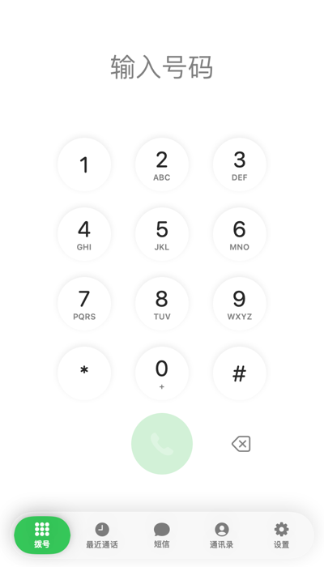
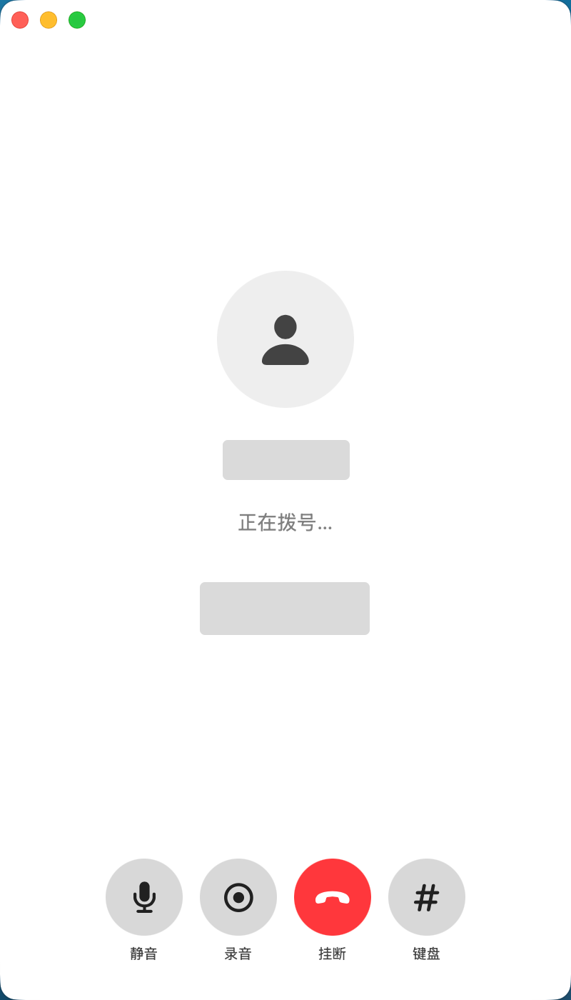
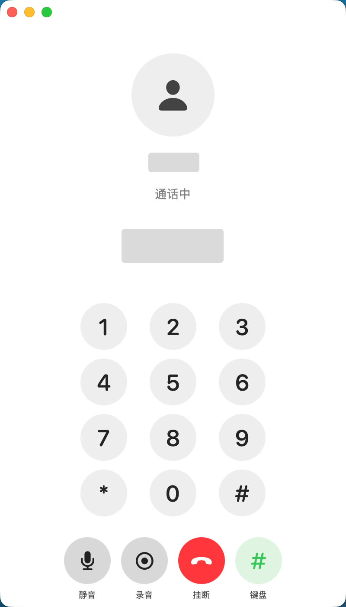
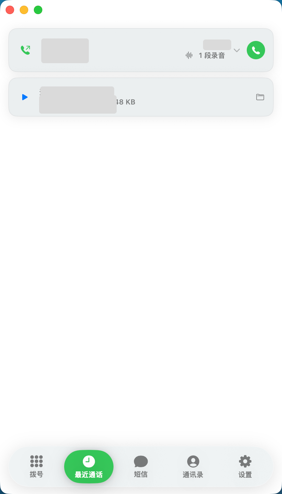
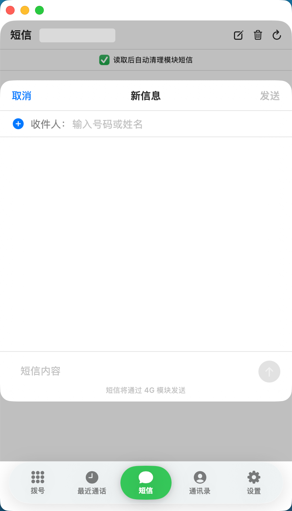
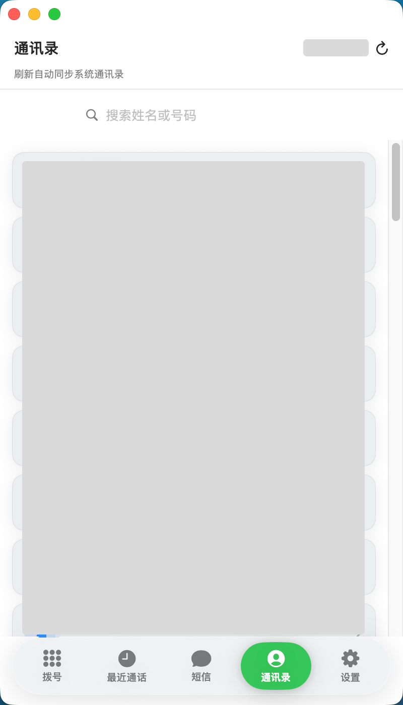
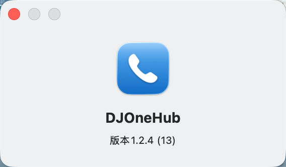

# DJOneHub

> 让大疆第一代 4G 模块成为 Mac 上长期可用的实体 SIM 终端。

DJOneHub 是一个非官方开源项目。它通过模块已有 USB 接口提供短信、4G、GPS、eSIM、来电及通话控制，不修改模块固件。

## 当前整合版本：v1.2.10 (19)

当前整合版本使用 macOS 客户端 `1.2.10 (19)`；上游来源和下面的 v1.2.9 历史说明保留不变。打包脚本默认输出 v1.2.10，避免源码版本、应用版本和 Release 资产名称不一致。

## v1.2.9：发布包与配置识别修复

修复 v1.2.8 安装包误带入旧通知 App 的问题。设置页不再显示遗留固定版本号，iPhone / iPad 连接模式入口恢复。`2CA3:4006 + 1,1,1,1,1,1,1` 会被识别为已启用完整音频接口的 DJI 配置，不再提示“不支持初始化”。

## v1.2.8：通话支持恢复与运行时下载修复

「设置 → 通话支持」现在同时识别原始模块配置和曾被其他工具改为旧 UAC 配置的模块。每次启用都会先备份当前 USB 配置；无法完成验证时自动恢复并显示原因，不会持续卡在初始化界面。

语音运行时下载使用固定上游与 SHA-256 校验，增加 GitHub Contents API 回退和重试，以减少上游瞬时下载失败的影响。

## v1.2.6：新增 iPhone / iPad 上网短信模式

独立 macOS App 集中管理拨号、通话、短信、通讯录和设置；来电与短信提醒不需要网页常驻。首次在「设置 → 语音运行时」确认后，App 会从固定上游来源下载指定版本、逐项校验 SHA-256 并缓存到本机；模块重启后自动复用缓存。

「设置 → 连接模式」新增 iPhone / iPad 模式：主动确认后，DJOneHub 只关闭模块 USB Audio，保留网卡、AT 和短信接口。设置会在下一次物理拔插时生效，因此可以直接把模块换接到 iPhone 或 iPad，避免系统把它当作音频输出设备。模块再次接入运行 DJOneHub 的 Mac 时，应用会自动恢复完整 USB Audio 配置并重新连接。

| 功能 | 说明 |
| --- | --- |
| 电话 | 拨号、接听、拒接、挂断、DTMF、通话记录和录音入口。 |
| 短信 | 收发短信、验证码预览；读取后可自动清理模块存储。 |
| 通讯录 | 可同步本机通讯录，用姓名或号码拨号、发短信。 |
| 网络与 GPS | USB 4G、Wi-Fi 优先、4G 兜底、GPS/GNSS 状态与菜单栏提示。 |
| iPhone / iPad 模式 | 关闭 USB Audio、保留上网和短信；下次接回 Mac 自动恢复完整模式。 |
| 模块工具 | eUICC Profile、AT 调试、网络诊断和初始化状态。 |

## 界面预览

> 以下均为真实界面截图；号码、联系人、头像、验证码和时间已遮蔽。

### 电话

<p align="center">
  
  
  
</p>

拨号、接听、拒接、挂断、DTMF、通话记录与录音入口统一在电话页。

<p align="center">
  
  
</p>

### 短信与通讯录

<p align="center">
  
  
</p>

短信支持收发、验证码预览和自动清理；通讯录可同步本机联系人并用于检索。

<p align="center">
  
</p>

### 设置与版本

<p align="center">
  
</p>

## 下载与平台状态

| 平台 | 包 | 当前状态 |
| --- | --- | --- |
| macOS 13+ | `DJOneHub-macOS-universal-v1.2.10.dmg` | Apple Silicon 实机验证；包内含 arm64 + x86_64，Intel 尚未真机验证。 |
| Windows x86-64 | `DJOneHub-Windows-amd64-v1.2.10.zip` | 内含 `DJOneHub.exe`；尚未在真实 Windows + 模块上验证。 |

Windows 目前不承诺模块功能可用；它不提供 macOS 专用的 USB AT/eSIM、USB 4G 自动策略、原生通知、MapKit 或双向通话音频。

## macOS 安装

1. 打开 DMG，运行“安装 DJOneHub.command”。
2. 日常直接打开 DJOneHub App；也可在安装目录运行 `djonehub start`。

本地服务只监听 `127.0.0.1:7575`。首次通话时，App 会请求麦克风权限。

## 通话与开源边界

源码包含 macOS App、Go 后端、Windows 控制台、MaVo MIT 音频适配代码和构建脚本。

Mac 双向通话仍需要模块侧语音运行时。该运行时**不随本仓库、Release、DMG 或 Windows ZIP 提供，也不会由 DJOneHub 镜像**。用户一次明确确认后，App 才会从固定上游来源获取指定版本，逐项校验 SHA-256 后保存到本机。上游文件、模块型号、固件、SIM 和运营商条件均可能影响双向语音可用性。

请不要把未知来源的二进制提交到 Issue、PR 或衍生 Release。完整边界见 [OPEN_SOURCE_SCOPE.md](OPEN_SOURCE_SCOPE.md)。

## 从源码构建

```sh
# macOS Universal
scripts/package-macos-universal.sh v1.2.10
scripts/build-dmg-universal.sh v1.2.10

# Windows x86-64
scripts/package-windows-amd64.sh v1.2.10
```

构建 macOS 包需要完整 Xcode、Go、`pkg-config` 与网络下载官方 libusb 源码。Windows 包在 Mac 上只能交叉编译，不能替代 Windows 真机验证。

## 使用提醒

- 使用蜂窝数据、短信、通话与 eSIM 前，请确认运营商协议、资费及当地法律要求。
- GPS 默认关闭；定位信息仅在本机读取和展示。
- 本项目不会上传 SIM、短信、联系人、录音或卡片资料。
- 与 DJI、Quectel、运营商及 eSIM 厂商不存在隶属或授权关系。

许可证与第三方声明见 [LICENSE](LICENSE)、[THIRD_PARTY_NOTICES.md](THIRD_PARTY_NOTICES.md) 与 [OPEN_SOURCE_SCOPE.md](OPEN_SOURCE_SCOPE.md)。
